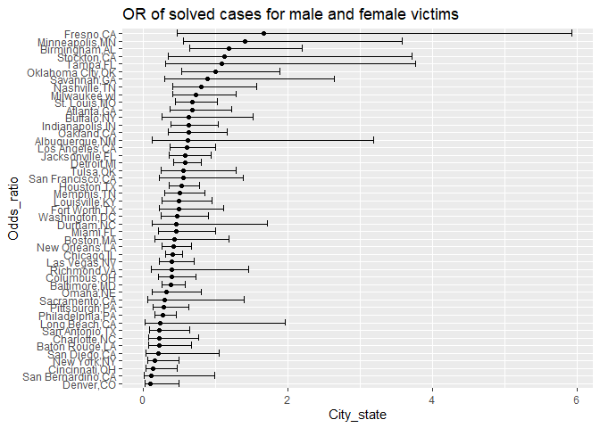
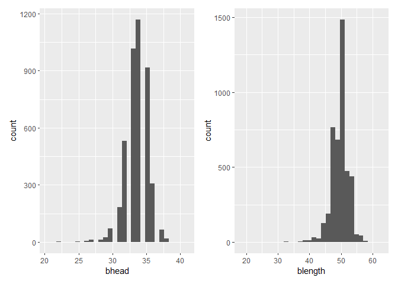

Simple document
================

    ## Warning: 程辑包'nlme'是用R版本4.2.2 来建造的

\#let’s begin

``` r
set.seed(001)
```

\#problem2 Create a *city_state* variable (e.g. “Baltimore, MD”), and *a
binary variable* indicating whether the homicide is solved.

``` r
homicide = read.csv("./homicide-data.csv") 

homicide=homicide%>% 
  na.omit() %>% 
  mutate(
    city_state=str_c(city,",",state)
  ) %>% 
  mutate(solve_sit = case_when(
    disposition== "Closed by arrest" ~ 1,
    disposition== "Open/No arrest" ~ 0)) %>% 
 mutate(
   unsolved = case_when(
     disposition== "Closed by arrest" ~ 0,
    disposition== "Open/No arrest" ~ 1))%>% 
  na.omit() 
```

Omit cities Dallas, TX; Phoenix, AZ; and Kansas City, MO – these don’t
report victim race. Also omit Tulsa, AL – this is a data entry mistake.
For this problem, limit your analysis those for whom victim_race is
white or black. Be sure that victim_age is numeric.

``` r
homicide =homicide%>% 
filter(!city_state %in% c("Dallas, TX", "Phoenix, AZ", "Kansas City, MO", "Tulsa, AL")) %>% 
  filter(str_detect(victim_race, c("White", "Black"))) %>% 
  mutate(victim_age =as.numeric(victim_age))%>% 
  na.omit()
```

    ## Warning in mask$eval_all_mutate(quo): 强制改变过程中产生了NA

For the city of Baltimore, MD, use the glm function to fit a logistic
regression with *resolved vs unresolved* as the outcome and *victim*
*age*, *sex* and *race* as predictors. Save the output of glm as an R
object;

``` r
data_B= filter(homicide,city_state=="Baltimore,MD")
data_B_model = data_B%>% 
  glm(solve_sit ~ victim_age + victim_race + victim_sex, data = ., family = binomial())

data_B_model %>% 
  broom::tidy(conf.int = TRUE) %>% 
  mutate(OR = exp(estimate), 
  conf_low=exp(estimate-1.96*std.error), 
  conf_high=exp(estimate+1.96*std.error)
  ) %>%
  select(term, log_OR = estimate, OR, p.value, conf_low, conf_high) %>% 
  knitr::kable(digits = 3)
```

| term             | log_OR |    OR | p.value | conf_low | conf_high |
|:-----------------|-------:|------:|--------:|---------:|----------:|
| (Intercept)      |  0.434 | 1.543 |   0.084 |    0.944 |     2.521 |
| victim_age       | -0.005 | 0.995 |   0.274 |    0.985 |     1.004 |
| victim_raceWhite |  0.978 | 2.658 |   0.000 |    1.598 |     4.419 |
| victim_sexMale   | -0.952 | 0.386 |   0.000 |    0.259 |     0.575 |

``` r
##
exp(summary(data_B_model)$coefficients["victim_sexMale",1] + qnorm(c(0.025,0.5,0.975)) * summary(data_B_model)$coefficients["victim_sexMale",2])
```

    ## [1] 0.2586549 0.3858014 0.5754490

Create a plot that shows the estimated ORs and CIs for each city.
Organize cities according to estimated OR, and comment on the plot.

``` r
all_city_model = 
  homicide %>%
  nest(data = -city_state) %>% 
  mutate(
    logmodel = map(data, ~glm(solve_sit~victim_age + victim_race + victim_sex, family = binomial(), data = ., )),
     result = map(.x=logmodel, ~broom::tidy(.x,conf.int = TRUE))) %>% 
  select(-data,-logmodel)%>% 
  unnest(result)%>% 
  mutate(
    OR = exp(estimate), 
    conf_low=exp(estimate-1.96*std.error), 
    conf_high=exp(estimate+1.96*std.error)
    ) %>%
  select(city_state,term, log_OR = estimate, OR, p.value, conf_low, conf_high) %>% 
  filter(term == "victim_sexMale")
```

    ## Warning: glm.fit:拟合機率算出来是数值零或一

    ## Warning: glm.fit:拟合機率算出来是数值零或一

    ## Warning: glm.fit:拟合機率算出来是数值零或一

    ## Warning: glm.fit:拟合機率算出来是数值零或一

    ## Warning: glm.fit:拟合機率算出来是数值零或一

    ## Warning: glm.fit:拟合機率算出来是数值零或一

    ## Warning: glm.fit:拟合機率算出来是数值零或一

    ## Warning: glm.fit:拟合機率算出来是数值零或一

    ## Warning: glm.fit:拟合機率算出来是数值零或一

    ## Warning: glm.fit:拟合機率算出来是数值零或一

    ## Warning: glm.fit:拟合機率算出来是数值零或一

    ## Warning: glm.fit:拟合機率算出来是数值零或一

    ## Warning: glm.fit:拟合機率算出来是数值零或一

    ## Warning: glm.fit:拟合機率算出来是数值零或一

    ## Warning: glm.fit:拟合機率算出来是数值零或一

    ## Warning: glm.fit:拟合機率算出来是数值零或一

    ## Warning: glm.fit:拟合機率算出来是数值零或一

    ## Warning: glm.fit:拟合機率算出来是数值零或一

    ## Warning: glm.fit:拟合機率算出来是数值零或一

    ## Warning: glm.fit:拟合機率算出来是数值零或一

    ## Warning: glm.fit:拟合機率算出来是数值零或一

    ## Warning: glm.fit:拟合機率算出来是数值零或一

    ## Warning: glm.fit:拟合機率算出来是数值零或一

    ## Warning: glm.fit:拟合機率算出来是数值零或一

    ## Warning: glm.fit:拟合機率算出来是数值零或一

    ## Warning: glm.fit:拟合機率算出来是数值零或一

    ## Warning: glm.fit:拟合機率算出来是数值零或一

    ## Warning: glm.fit:拟合機率算出来是数值零或一

    ## Warning: glm.fit:拟合機率算出来是数值零或一

    ## Warning: glm.fit:拟合機率算出来是数值零或一

    ## Warning: glm.fit:拟合機率算出来是数值零或一

    ## Warning: glm.fit:拟合機率算出来是数值零或一

    ## Warning: glm.fit:拟合機率算出来是数值零或一

    ## Warning: glm.fit:拟合機率算出来是数值零或一

    ## Warning: glm.fit:拟合機率算出来是数值零或一

    ## Warning: glm.fit:拟合機率算出来是数值零或一

    ## Warning: glm.fit:拟合機率算出来是数值零或一

    ## Warning: glm.fit:拟合機率算出来是数值零或一

    ## Warning in regularize.values(x, y, ties, missing(ties), na.rm = na.rm): 折
    ## 拢'x'成相互不同的值

``` r
all_city_model%>%
  mutate(
    city_state = fct_reorder(city_state, OR)
  ) %>%
  ggplot(aes(x = OR, y = city_state)) +
  geom_point() +
  geom_errorbar(aes(xmin = conf_low, xmax = conf_high)) +
  labs(title = "OR of solved cases for male and female victims",
       x="City_state",
       y="Odds_ratio"
         )
```

<!-- -->

\#problem3 Load and clean the data for regression analysis (i.e. convert
numeric to factor where appropriate, check for missing data, etc.).

Propose a *regression model* for birthweight. This model may be based on
a hypothesized structure for the factors that underly birthweight, on a
data-driven model-building process, or a combination of the two.
Describe your modeling process and show a plot of model *residuals
against fitted values* – *use add_predictions* and *add_residuals* in
making this plot.

## 3.0 reclaim data

``` r
data_bw <- read.csv("./birthweight.csv")%>% 
  na.omit() %>% 
  mutate(
    babysex = as.factor(babysex),
    frace = as.factor(frace), 
    malform = as.factor(malform),
    mrace = factor(mrace)
    )
```

## 3.1 variables visualization

### 3.1.1 dependent variable visual

``` r
density_bwt <- data_bw %>% 
  ggplot(aes(x = bwt)) + 
  geom_histogram()
density_bwt
```

    ## `stat_bin()` using `bins = 30`. Pick better value with `binwidth`.

<!-- -->
From the plot, we can roughly assume that the distribution of bwt
follows normal distribution.

### 3.1.2 Independent variable visual

``` r
density_bhead <- data_bw %>% 
  ggplot(aes(x = bhead)) + 
  geom_histogram()
density_blength <- data_bw %>% 
  ggplot(aes(x = blength)) + 
  geom_histogram()
density_bhead+density_blength
```

    ## `stat_bin()` using `bins = 30`. Pick better value with `binwidth`.
    ## `stat_bin()` using `bins = 30`. Pick better value with `binwidth`.

<!-- -->
From the density distribution plot, we can see that the distribution of
bhead variable and blength variable is normal. Thus, we can directly put
them into our linear regression model.

## 3.1.3 the relation ship among varaibles

``` r
data_bw1=data_bw %>% 
  select(bwt,bhead,blength)
plot(data_bw1)
```

<!-- -->
From the plot, we can be sure that there is relationship between bwt and
blength and the same for bhead. So next step, we can use linear
regression model to get the further development,

## 3.2 linear regression

``` r
set.seed(002)
fit_headlength = lm(bwt ~ bhead+blength, data = data_bw)
summary(fit_headlength)
```

    ## 
    ## Call:
    ## lm(formula = bwt ~ bhead + blength, data = data_bw)
    ## 
    ## Residuals:
    ##      Min       1Q   Median       3Q      Max 
    ## -1116.99  -185.71    -8.95   182.38  2677.29 
    ## 
    ## Coefficients:
    ##              Estimate Std. Error t value Pr(>|t|)    
    ## (Intercept) -6029.620     95.821  -62.93   <2e-16 ***
    ## bhead         146.021      3.489   41.85   <2e-16 ***
    ## blength        85.030      2.076   40.95   <2e-16 ***
    ## ---
    ## Signif. codes:  0 '***' 0.001 '**' 0.01 '*' 0.05 '.' 0.1 ' ' 1
    ## 
    ## Residual standard error: 289.2 on 4339 degrees of freedom
    ## Multiple R-squared:  0.6813, Adjusted R-squared:  0.6812 
    ## F-statistic:  4639 on 2 and 4339 DF,  p-value: < 2.2e-16

``` r
fit_headlength %>% 
  broom::glance()%>% 
  broom::tidy()
```

    ## Warning: Data frame tidiers are deprecated and will be removed in an upcoming
    ## release of broom.

    ## # A tibble: 12 × 13
    ##    column       n     mean    sd   median  trimmed   mad      min      max range
    ##    <chr>    <dbl>    <dbl> <dbl>    <dbl>    <dbl> <dbl>    <dbl>    <dbl> <dbl>
    ##  1 r.squar…     1  6.81e-1    NA  6.81e-1  6.81e-1     0  6.81e-1  6.81e-1     0
    ##  2 adj.r.s…     1  6.81e-1    NA  6.81e-1  6.81e-1     0  6.81e-1  6.81e-1     0
    ##  3 sigma        1  2.89e+2    NA  2.89e+2  2.89e+2     0  2.89e+2  2.89e+2     0
    ##  4 statist…     1  4.64e+3    NA  4.64e+3  4.64e+3     0  4.64e+3  4.64e+3     0
    ##  5 p.value      1  0          NA  0        0           0  0        0           0
    ##  6 df           1  2   e+0    NA  2   e+0  2   e+0     0  2   e+0  2   e+0     0
    ##  7 logLik       1 -3.08e+4    NA -3.08e+4 -3.08e+4     0 -3.08e+4 -3.08e+4     0
    ##  8 AIC          1  6.15e+4    NA  6.15e+4  6.15e+4     0  6.15e+4  6.15e+4     0
    ##  9 BIC          1  6.16e+4    NA  6.16e+4  6.16e+4     0  6.16e+4  6.16e+4     0
    ## 10 deviance     1  3.63e+8    NA  3.63e+8  3.63e+8     0  3.63e+8  3.63e+8     0
    ## 11 df.resi…     1  4.34e+3    NA  4.34e+3  4.34e+3     0  4.34e+3  4.34e+3     0
    ## 12 nobs         1  4.34e+3    NA  4.34e+3  4.34e+3     0  4.34e+3  4.34e+3     0
    ## # … with 3 more variables: skew <dbl>, kurtosis <dbl>, se <dbl>

## 3.3 diagnosis for linear regression model

``` r
data_bw %>% 
  modelr::add_residuals(fit_headlength) %>% 
  modelr::add_predictions(fit_headlength) %>%
  ggplot(aes(x = pred, y = resid)) + 
  geom_point()+
  labs(
   title="head-lengh of residual vs fitted value",
   y="Residual" ,
   x="fitted value"
  )
```

<!-- -->

Compare your model to two others:

One using length at birth and gestational age as predictors (main
effects only) One using head circumference, length, sex, and all
interactions (including the three-way interaction) between these
