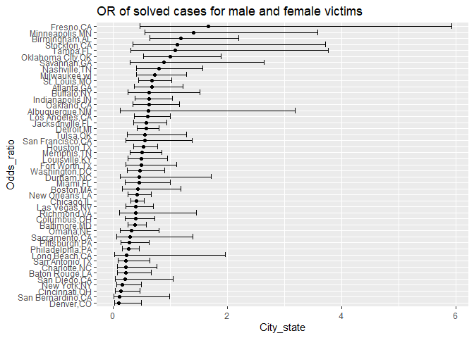

Simple document
================

\#let’s begin

``` r
library(tidyverse)
library(modelr)
library(mgcv)
```

    ## 载入需要的程辑包：nlme

    ## Warning: 程辑包'nlme'是用R版本4.2.2 来建造的

    ## 
    ## 载入程辑包：'nlme'

    ## The following object is masked from 'package:dplyr':
    ## 
    ##     collapse

    ## This is mgcv 1.8-40. For overview type 'help("mgcv-package")'.

``` r
set.seed(1)
```

\#problem2 Create a *city_state* variable (e.g. “Baltimore, MD”), and *a
binary variable* indicating whether the homicide is solved.

``` r
homicide = read.csv("./homicide-data.csv") 

homicide=homicide%>% 
  na.omit() %>% 
  mutate(
    city_state=str_c(city,",",state)
  ) %>% 
  mutate(solve_sit = case_when(
    disposition== "Closed by arrest" ~ 1,
    disposition== "Open/No arrest" ~ 0)) %>% 
 mutate(
   unsolved = case_when(
     disposition== "Closed by arrest" ~ 0,
    disposition== "Open/No arrest" ~ 1))%>% 
  na.omit() 
```

Omit cities Dallas, TX; Phoenix, AZ; and Kansas City, MO – these don’t
report victim race. Also omit Tulsa, AL – this is a data entry mistake.
For this problem, limit your analysis those for whom victim_race is
white or black. Be sure that victim_age is numeric.

``` r
homicide =homicide%>% 
filter(!city_state %in% c("Dallas, TX", "Phoenix, AZ", "Kansas City, MO", "Tulsa, AL")) %>% 
  filter(str_detect(victim_race, c("White", "Black"))) %>% 
  mutate(victim_age =as.numeric(victim_age))%>% 
  na.omit()
```

    ## Warning in mask$eval_all_mutate(quo): 强制改变过程中产生了NA

For the city of Baltimore, MD, use the glm function to fit a logistic
regression with *resolved vs unresolved* as the outcome and *victim*
*age*, *sex* and *race* as predictors. Save the output of glm as an R
object;

``` r
data_B= filter(homicide,city_state=="Baltimore,MD")
data_B_model = data_B%>% 
  glm(solve_sit ~ victim_age + victim_race + victim_sex, data = ., family = binomial())

data_B_model %>% 
  broom::tidy(conf.int = TRUE) %>% 
  mutate(OR = exp(estimate), 
  conf_low=exp(estimate-1.96*std.error), 
  conf_high=exp(estimate+1.96*std.error)
  ) %>%
  select(term, log_OR = estimate, OR, p.value, conf_low, conf_high) %>% 
  knitr::kable(digits = 3)
```

| term             | log_OR |    OR | p.value | conf_low | conf_high |
|:-----------------|-------:|------:|--------:|---------:|----------:|
| (Intercept)      |  0.434 | 1.543 |   0.084 |    0.944 |     2.521 |
| victim_age       | -0.005 | 0.995 |   0.274 |    0.985 |     1.004 |
| victim_raceWhite |  0.978 | 2.658 |   0.000 |    1.598 |     4.419 |
| victim_sexMale   | -0.952 | 0.386 |   0.000 |    0.259 |     0.575 |

``` r
##
exp(summary(data_B_model)$coefficients["victim_sexMale",1] + qnorm(c(0.025,0.5,0.975)) * summary(data_B_model)$coefficients["victim_sexMale",2])
```

    ## [1] 0.2586549 0.3858014 0.5754490

Create a plot that shows the estimated ORs and CIs for each city.
Organize cities according to estimated OR, and comment on the plot.

``` r
all_city_model = 
  homicide %>%
  nest(data = -city_state) %>% 
  mutate(
    logmodel = map(data, ~glm(solve_sit~victim_age + victim_race + victim_sex, family = binomial(), data = ., )),
     result = map(.x=logmodel, ~broom::tidy(.x,conf.int = TRUE))) %>% 
  select(-data,-logmodel)%>% 
  unnest(result)%>% 
  mutate(
    OR = exp(estimate), 
    conf_low=exp(estimate-1.96*std.error), 
    conf_high=exp(estimate+1.96*std.error)
    ) %>%
  select(city_state,term, log_OR = estimate, OR, p.value, conf_low, conf_high) %>% 
  filter(term == "victim_sexMale")
```

    ## Warning: glm.fit:拟合機率算出来是数值零或一

    ## Warning: glm.fit:拟合機率算出来是数值零或一

    ## Warning: glm.fit:拟合機率算出来是数值零或一

    ## Warning: glm.fit:拟合機率算出来是数值零或一

    ## Warning: glm.fit:拟合機率算出来是数值零或一

    ## Warning: glm.fit:拟合機率算出来是数值零或一

    ## Warning: glm.fit:拟合機率算出来是数值零或一

    ## Warning: glm.fit:拟合機率算出来是数值零或一

    ## Warning: glm.fit:拟合機率算出来是数值零或一

    ## Warning: glm.fit:拟合機率算出来是数值零或一

    ## Warning: glm.fit:拟合機率算出来是数值零或一

    ## Warning: glm.fit:拟合機率算出来是数值零或一

    ## Warning: glm.fit:拟合機率算出来是数值零或一

    ## Warning: glm.fit:拟合機率算出来是数值零或一

    ## Warning: glm.fit:拟合機率算出来是数值零或一

    ## Warning: glm.fit:拟合機率算出来是数值零或一

    ## Warning: glm.fit:拟合機率算出来是数值零或一

    ## Warning: glm.fit:拟合機率算出来是数值零或一

    ## Warning: glm.fit:拟合機率算出来是数值零或一

    ## Warning: glm.fit:拟合機率算出来是数值零或一

    ## Warning: glm.fit:拟合機率算出来是数值零或一

    ## Warning: glm.fit:拟合機率算出来是数值零或一

    ## Warning: glm.fit:拟合機率算出来是数值零或一

    ## Warning: glm.fit:拟合機率算出来是数值零或一

    ## Warning: glm.fit:拟合機率算出来是数值零或一

    ## Warning: glm.fit:拟合機率算出来是数值零或一

    ## Warning: glm.fit:拟合機率算出来是数值零或一

    ## Warning: glm.fit:拟合機率算出来是数值零或一

    ## Warning: glm.fit:拟合機率算出来是数值零或一

    ## Warning: glm.fit:拟合機率算出来是数值零或一

    ## Warning: glm.fit:拟合機率算出来是数值零或一

    ## Warning: glm.fit:拟合機率算出来是数值零或一

    ## Warning: glm.fit:拟合機率算出来是数值零或一

    ## Warning: glm.fit:拟合機率算出来是数值零或一

    ## Warning: glm.fit:拟合機率算出来是数值零或一

    ## Warning: glm.fit:拟合機率算出来是数值零或一

    ## Warning: glm.fit:拟合機率算出来是数值零或一

    ## Warning: glm.fit:拟合機率算出来是数值零或一

    ## Warning in regularize.values(x, y, ties, missing(ties), na.rm = na.rm): 折
    ## 拢'x'成相互不同的值

``` r
all_city_model%>%
  mutate(
    city_state = fct_reorder(city_state, OR)
  ) %>%
  ggplot(aes(x = OR, y = city_state)) +
  geom_point() +
  geom_errorbar(aes(xmin = conf_low, xmax = conf_high)) +
  labs(title = "OR of solved cases for male and female victims",
       x="City_state",
       y="Odds_ratio"
         )
```

<!-- -->

\#problem3 Load and clean the data for regression analysis (i.e. convert
numeric to factor where appropriate, check for missing data, etc.).

Propose a regression model for birthweight. This model may be based on a
hypothesized structure for the factors that underly birthweight, on a
data-driven model-building process, or a combination of the two.
Describe your modeling process and show a plot of model residuals
against fitted values – use add_predictions and add_residuals in making
this plot.

``` r
data_bw <- read.csv("./birthweight.csv")%>% 
  na.omit() %>% 
  mutate(
    babysex = as.factor(babysex),
    frace = as.factor(frace), 
    malform = as.factor(malform),
    mrace = factor(mrace)
    )
  
data_bw %>% 
  ggplot(aes(x = bhead, y = bwt)) + 
  geom_point(alpha = .5)+
  ylab("Baby weight at birth") +
  xlab("Baby head circumference at birth") +
  labs(title = "plot of baby weight vs baby head circumference at birth")
```

<!-- -->
