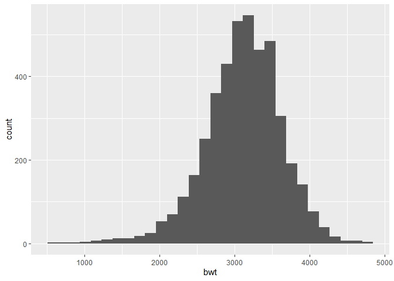

Simple document
================

    ## Warning: 程辑包'nlme'是用R版本4.2.2 来建造的

\#let’s begin

``` r
set.seed(001)
```

# problem2

## 2.1 tidy data

REQUIREMENT:Create a *city_state* variable (e.g. “Baltimore, MD”), and
*a binary variable* indicating whether the homicide is solved.

``` r
homicide = read.csv("./homicide-data.csv") 

summary(homicide$disposition)
```

    ##    Length     Class      Mode 
    ##     52179 character character

``` r
homicide=homicide%>% 
  na.omit() %>% 
  mutate(
    city_state=str_c(city,", ",state)
  ) %>% 
  mutate(solve_sit = case_when(
    disposition== "Closed by arrest" ~ 1,
    disposition== "Open/No arrest" ~ 0,
     disposition== "Closed without arrest" ~ 0)) 
```

Based on the requirement of problem2.1, we give a numerical definition
for disposition. However, with recognizing that most of the disposition
data including three kinds of description:“Closed by arrest”, “Open/No
arrest” and “Closed without arrest”, We consider the first as resolved
event and the others as unresolved event.

REQUIREMENT:Omit cities Dallas, TX; Phoenix, AZ; and Kansas City, MO –
these don’t report victim race. Also omit Tulsa, AL – this is a data
entry mistake. For this problem, limit your analysis those for whom
victim_race is white or black. Be sure that victim_age is numeric.

``` r
homicide =homicide%>% 
filter(!city_state %in% c("Dallas, TX", "Phoenix, AZ", "Kansas City, MO", "Tulsa, AL")) %>% 
  filter(victim_race %in% c("White", "Black")) %>% 
  filter(!victim_sex=="Unknown") %>% 
  mutate(
    victim_age = as.numeric(victim_age),
    victim_sex = as.factor(victim_sex),
    victim_race = as.factor(victim_race),
    )
```

    ## Warning in mask$eval_all_mutate(quo): 强制改变过程中产生了NA

``` r
homicide = homicide %>% 
  filter(city_state !="Tulsa, AL")
```

Based on the requirements for the cit_state and race, we finally obtain
the results data: *homicide*

## 2.1 build linear regression model

REQUIREMENT:For the city of Baltimore, MD, use the glm function to fit a
logistic regression with *resolved vs unresolved* as the outcome and
*victim* *age*, *sex* and *race* as predictors.

``` r
data_B= filter(homicide,city_state=="Baltimore, MD")
data_B_model = data_B%>% 
  glm(solve_sit ~ victim_age + victim_race + victim_sex, data = ., family = binomial())
```

REQUIRMENT:Save the output of glm as an R object;

``` r
save(data_B_model, file = "./data_B_model.RData")
data_B_model
```

    ## 
    ## Call:  glm(formula = solve_sit ~ victim_age + victim_race + victim_sex, 
    ##     family = binomial(), data = .)
    ## 
    ## Coefficients:
    ##      (Intercept)        victim_age  victim_raceWhite    victim_sexMale  
    ##         0.309981         -0.006727          0.841756         -0.854463  
    ## 
    ## Degrees of Freedom: 2752 Total (i.e. Null);  2749 Residual
    ## Null Deviance:       3568 
    ## Residual Deviance: 3493  AIC: 3501

REQUIREMENT:apply the *broom::tidy* to this object; and obtain the
*estimate* and *confidence interval* of the adjusted odds ratio for
solving homicides comparing male victims to female victims keeping all
other variables fixed.

``` r
data_B_model %>% 
  broom::tidy(conf.int = TRUE) %>% 
  mutate(
  OR = exp(estimate), 
  conf_low=exp(estimate+qnorm(0.05)*std.error), 
  conf_high=exp(estimate+qnorm(0.95)*std.error)
  ) %>%
  select(term, log_OR = estimate, OR, p.value, conf_low, conf_high) %>% 
  knitr::kable(digits = 3)
```

| term             | log_OR |    OR | p.value | conf_low | conf_high |
|:-----------------|-------:|------:|--------:|---------:|----------:|
| (Intercept)      |  0.310 | 1.363 |   0.070 |    1.029 |     1.807 |
| victim_age       | -0.007 | 0.993 |   0.043 |    0.988 |     0.999 |
| victim_raceWhite |  0.842 | 2.320 |   0.000 |    1.741 |     3.093 |
| victim_sexMale   | -0.854 | 0.426 |   0.000 |    0.339 |     0.534 |

``` r
data_B_model %>% 
  broom::tidy(conf.int = TRUE) %>% 
  mutate(
  OR = exp(estimate), 
  conf_low=exp(estimate+qnorm(0.025)*std.error), 
  conf_high=exp(estimate+qnorm(0.975)*std.error)
  ) %>%
  filter(term=="victim_sexMale") %>% 
  select(term, log_OR = estimate, OR, p.value, conf_low, conf_high) %>% 
  knitr::kable(digits = 3)
```

| term           | log_OR |    OR | p.value | conf_low | conf_high |
|:---------------|-------:|------:|--------:|---------:|----------:|
| victim_sexMale | -0.854 | 0.426 |       0 |    0.325 |     0.558 |

REQUIREMENT:Now run glm for each of the cities in your dataset, and
extract the adjusted odds ratio (and CI) for solving homicides comparing
male victims to female victims. Do this within a “tidy” pipeline, making
use of purrr::map, list columns, and unnest as necessary to create a
dataframe with estimated ORs and CIs for each city.

``` r
all_city_model = 
   homicide %>%
  select(city_state,solve_sit,victim_age,victim_sex,victim_race) %>% 
  nest(data = -city_state) %>% 
  mutate(
    logmodel = map(data, ~glm(solve_sit~victim_age + victim_race + victim_sex, data = ., family = binomial())),
 result = map(.x=logmodel, ~broom::tidy(.x,conf.int = TRUE))) %>% 
  select(-data,-logmodel)%>% 
  unnest(result)%>% 
  mutate(
    OR = exp(estimate), 
    conf_low=exp(estimate+qnorm(0.05)*std.error), 
    conf_high=exp(estimate+qnorm(0.95)*std.error)
    ) %>%
   filter(term=="victim_sexMale") %>% 
  select(city_state, OR,conf_low, conf_high) 
```

REQUIREMENT:Create a plot that shows the estimated ORs and CIs for each
city. Organize cities according to estimated OR, and comment on the plot

``` r
all_city_model%>%
  mutate( 
    city_state = fct_reorder(city_state, OR)
  ) %>%
  ggplot(aes(x = city_state, y = OR )) +
  geom_point() +
  geom_errorbar(aes(ymin = conf_low, ymax = conf_high)) +
  labs(title = "OR of solved cases for male and female victims",
       x="Odds.ratio",
       y="City-states"
         )+
  theme(
    title=element_text(size=9),
    axis.text.x.bottom = element_text(angle=45, hjust=1)
  )
```

<!-- -->

Execute the function on the data of each city, and calculate the
corresponding OR and its CI. Then we sort and draw the image according
to the value of OR \#problem3 Load and clean the data for regression
analysis (i.e. convert numeric to factor where appropriate, check for
missing data, etc.). \## 3.0 reclaim data

``` r
data_bw <- read.csv("./birthweight.csv")%>% 
  na.omit() %>% 
  mutate(
    babysex = as.factor(babysex),
    frace = as.factor(frace), 
    malform = as.factor(malform),
    mrace = factor(mrace)
    )
```

Propose a *regression model* for birthweight. This model may be based on
a hypothesized structure for the factors that underly birthweight, on a
data-driven model-building process, or a combination of the two. \## 3.1
variables visualization

### 3.1.1 dependent variable visual

``` r
density_bwt <- data_bw %>% 
  ggplot(aes(x = bwt)) + 
  geom_histogram()
density_bwt
```

    ## `stat_bin()` using `bins = 30`. Pick better value with `binwidth`.

<!-- -->

From the plot, we can roughly assume that the distribution of bwt
follows normal distribution.

### 3.1.2 Independent variable visual

``` r
density_bhead <- data_bw %>% 
  ggplot(aes(x = bhead)) + 
  geom_histogram()
density_blength <- data_bw %>% 
  ggplot(aes(x = blength)) + 
  geom_histogram()
density_bhead+density_blength
```

    ## `stat_bin()` using `bins = 30`. Pick better value with `binwidth`.
    ## `stat_bin()` using `bins = 30`. Pick better value with `binwidth`.

<!-- -->

From the density distribution plot, we can see that the distribution of
bhead variable and blength variable is normal. Thus, we can directly put
them into our linear regression model.

## 3.1.3 the relation ship among varaibles

``` r
data_bw1=data_bw %>% 
  select(bwt,bhead,blength)
plot(data_bw1)
```

<!-- -->

From the plot, we can be sure that there is relationship between bwt and
blength and the same for bhead. So next step, we can use linear
regression model to get the further development,

## 3.2 linear regression

``` r
set.seed(002)
fit_headlength = lm(bwt ~ bhead+blength, data = data_bw)
summary(fit_headlength)
```

    ## 
    ## Call:
    ## lm(formula = bwt ~ bhead + blength, data = data_bw)
    ## 
    ## Residuals:
    ##      Min       1Q   Median       3Q      Max 
    ## -1116.99  -185.71    -8.95   182.38  2677.29 
    ## 
    ## Coefficients:
    ##              Estimate Std. Error t value Pr(>|t|)    
    ## (Intercept) -6029.620     95.821  -62.93   <2e-16 ***
    ## bhead         146.021      3.489   41.85   <2e-16 ***
    ## blength        85.030      2.076   40.95   <2e-16 ***
    ## ---
    ## Signif. codes:  0 '***' 0.001 '**' 0.01 '*' 0.05 '.' 0.1 ' ' 1
    ## 
    ## Residual standard error: 289.2 on 4339 degrees of freedom
    ## Multiple R-squared:  0.6813, Adjusted R-squared:  0.6812 
    ## F-statistic:  4639 on 2 and 4339 DF,  p-value: < 2.2e-16

``` r
fit_headlength %>% 
  broom::glance()%>% 
  broom::tidy()
```

    ## Warning: Data frame tidiers are deprecated and will be removed in an upcoming
    ## release of broom.

    ## # A tibble: 12 × 13
    ##    column       n     mean    sd   median  trimmed   mad      min      max range
    ##    <chr>    <dbl>    <dbl> <dbl>    <dbl>    <dbl> <dbl>    <dbl>    <dbl> <dbl>
    ##  1 r.squar…     1  6.81e-1    NA  6.81e-1  6.81e-1     0  6.81e-1  6.81e-1     0
    ##  2 adj.r.s…     1  6.81e-1    NA  6.81e-1  6.81e-1     0  6.81e-1  6.81e-1     0
    ##  3 sigma        1  2.89e+2    NA  2.89e+2  2.89e+2     0  2.89e+2  2.89e+2     0
    ##  4 statist…     1  4.64e+3    NA  4.64e+3  4.64e+3     0  4.64e+3  4.64e+3     0
    ##  5 p.value      1  0          NA  0        0           0  0        0           0
    ##  6 df           1  2   e+0    NA  2   e+0  2   e+0     0  2   e+0  2   e+0     0
    ##  7 logLik       1 -3.08e+4    NA -3.08e+4 -3.08e+4     0 -3.08e+4 -3.08e+4     0
    ##  8 AIC          1  6.15e+4    NA  6.15e+4  6.15e+4     0  6.15e+4  6.15e+4     0
    ##  9 BIC          1  6.16e+4    NA  6.16e+4  6.16e+4     0  6.16e+4  6.16e+4     0
    ## 10 deviance     1  3.63e+8    NA  3.63e+8  3.63e+8     0  3.63e+8  3.63e+8     0
    ## 11 df.resi…     1  4.34e+3    NA  4.34e+3  4.34e+3     0  4.34e+3  4.34e+3     0
    ## 12 nobs         1  4.34e+3    NA  4.34e+3  4.34e+3     0  4.34e+3  4.34e+3     0
    ## # … with 3 more variables: skew <dbl>, kurtosis <dbl>, se <dbl>

Describe your modeling process and show a plot of model *residuals
against fitted values* – *use add_predictions* and *add_residuals* in
making this plot. \## 3.3 diagnosis for linear regression model

``` r
data_bw %>% 
  modelr::add_residuals(fit_headlength) %>% 
  modelr::add_predictions(fit_headlength) %>%
  ggplot(aes(x = pred, y = resid)) + 
  geom_point()+
  labs(
   title="head-lengh of residual vs fitted value",
   y="Residual" ,
   x="fitted value"
  )
```

<!-- -->

First, we verified the assumption that the variables basically satisfy
the normal distribution. Next, we drew a scatter diagram of the
variables in pairs to observe whether the two independent variables have
an impact on the dependent variable, and roughly estimate whether the
impact is positive or negative.Further, we performed multiple linear
regression and finally got the linear model.

From the residuals vs fitted value graph, we can see that, first of all,
the data satisfies a symmetrical distribution around 0. But as the
fitted value increases, the data becomes more dense. This shows that
there are outliers in the fitted value.

## 3.4 manipulate three models and get the results

Compare your model to two others: 1.One using *length at birth* and
*gestational age* as predictors (main effects only) 2.One using *head
circumference*, *length*, *sex*, and *all interactions* (including the
three-way interaction) between these

``` r
fit_lg = lm(bwt ~ gaweeks + blength, data =data_bw)
summary(fit_lg)
```

    ## 
    ## Call:
    ## lm(formula = bwt ~ gaweeks + blength, data = data_bw)
    ## 
    ## Residuals:
    ##     Min      1Q  Median      3Q     Max 
    ## -1709.6  -215.4   -11.4   208.2  4188.8 
    ## 
    ## Coefficients:
    ##              Estimate Std. Error t value Pr(>|t|)    
    ## (Intercept) -4347.667     97.958  -44.38   <2e-16 ***
    ## gaweeks        27.047      1.718   15.74   <2e-16 ***
    ## blength       128.556      1.990   64.60   <2e-16 ***
    ## ---
    ## Signif. codes:  0 '***' 0.001 '**' 0.01 '*' 0.05 '.' 0.1 ' ' 1
    ## 
    ## Residual standard error: 333.2 on 4339 degrees of freedom
    ## Multiple R-squared:  0.5769, Adjusted R-squared:  0.5767 
    ## F-statistic:  2958 on 2 and 4339 DF,  p-value: < 2.2e-16

``` r
fit_lg %>% 
  broom::glance()%>% 
  broom::tidy()
```

    ## Warning: Data frame tidiers are deprecated and will be removed in an upcoming
    ## release of broom.

    ## # A tibble: 12 × 13
    ##    column       n     mean    sd   median  trimmed   mad      min      max range
    ##    <chr>    <dbl>    <dbl> <dbl>    <dbl>    <dbl> <dbl>    <dbl>    <dbl> <dbl>
    ##  1 r.squar…     1  5.77e-1    NA  5.77e-1  5.77e-1     0  5.77e-1  5.77e-1     0
    ##  2 adj.r.s…     1  5.77e-1    NA  5.77e-1  5.77e-1     0  5.77e-1  5.77e-1     0
    ##  3 sigma        1  3.33e+2    NA  3.33e+2  3.33e+2     0  3.33e+2  3.33e+2     0
    ##  4 statist…     1  2.96e+3    NA  2.96e+3  2.96e+3     0  2.96e+3  2.96e+3     0
    ##  5 p.value      1  0          NA  0        0           0  0        0           0
    ##  6 df           1  2   e+0    NA  2   e+0  2   e+0     0  2   e+0  2   e+0     0
    ##  7 logLik       1 -3.14e+4    NA -3.14e+4 -3.14e+4     0 -3.14e+4 -3.14e+4     0
    ##  8 AIC          1  6.28e+4    NA  6.28e+4  6.28e+4     0  6.28e+4  6.28e+4     0
    ##  9 BIC          1  6.28e+4    NA  6.28e+4  6.28e+4     0  6.28e+4  6.28e+4     0
    ## 10 deviance     1  4.82e+8    NA  4.82e+8  4.82e+8     0  4.82e+8  4.82e+8     0
    ## 11 df.resi…     1  4.34e+3    NA  4.34e+3  4.34e+3     0  4.34e+3  4.34e+3     0
    ## 12 nobs         1  4.34e+3    NA  4.34e+3  4.34e+3     0  4.34e+3  4.34e+3     0
    ## # … with 3 more variables: skew <dbl>, kurtosis <dbl>, se <dbl>

``` r
fit_all = lm(bwt ~ bhead * blength * babysex, data = data_bw)
summary(fit_all)
```

    ## 
    ## Call:
    ## lm(formula = bwt ~ bhead * blength * babysex, data = data_bw)
    ## 
    ## Residuals:
    ##      Min       1Q   Median       3Q      Max 
    ## -1132.99  -190.42   -10.33   178.63  2617.96 
    ## 
    ## Coefficients:
    ##                          Estimate Std. Error t value Pr(>|t|)    
    ## (Intercept)            -7176.8170  1264.8397  -5.674 1.49e-08 ***
    ## bhead                    181.7956    38.0542   4.777 1.84e-06 ***
    ## blength                  102.1269    26.2118   3.896 9.92e-05 ***
    ## babysex2                6374.8684  1677.7669   3.800 0.000147 ***
    ## bhead:blength             -0.5536     0.7802  -0.710 0.478012    
    ## bhead:babysex2          -198.3932    51.0917  -3.883 0.000105 ***
    ## blength:babysex2        -123.7729    35.1185  -3.524 0.000429 ***
    ## bhead:blength:babysex2     3.8781     1.0566   3.670 0.000245 ***
    ## ---
    ## Signif. codes:  0 '***' 0.001 '**' 0.01 '*' 0.05 '.' 0.1 ' ' 1
    ## 
    ## Residual standard error: 287.7 on 4334 degrees of freedom
    ## Multiple R-squared:  0.6849, Adjusted R-squared:  0.6844 
    ## F-statistic:  1346 on 7 and 4334 DF,  p-value: < 2.2e-16

``` r
fit_lg %>% 
  broom::glance()%>% 
  broom::tidy()
```

    ## Warning: Data frame tidiers are deprecated and will be removed in an upcoming
    ## release of broom.

    ## # A tibble: 12 × 13
    ##    column       n     mean    sd   median  trimmed   mad      min      max range
    ##    <chr>    <dbl>    <dbl> <dbl>    <dbl>    <dbl> <dbl>    <dbl>    <dbl> <dbl>
    ##  1 r.squar…     1  5.77e-1    NA  5.77e-1  5.77e-1     0  5.77e-1  5.77e-1     0
    ##  2 adj.r.s…     1  5.77e-1    NA  5.77e-1  5.77e-1     0  5.77e-1  5.77e-1     0
    ##  3 sigma        1  3.33e+2    NA  3.33e+2  3.33e+2     0  3.33e+2  3.33e+2     0
    ##  4 statist…     1  2.96e+3    NA  2.96e+3  2.96e+3     0  2.96e+3  2.96e+3     0
    ##  5 p.value      1  0          NA  0        0           0  0        0           0
    ##  6 df           1  2   e+0    NA  2   e+0  2   e+0     0  2   e+0  2   e+0     0
    ##  7 logLik       1 -3.14e+4    NA -3.14e+4 -3.14e+4     0 -3.14e+4 -3.14e+4     0
    ##  8 AIC          1  6.28e+4    NA  6.28e+4  6.28e+4     0  6.28e+4  6.28e+4     0
    ##  9 BIC          1  6.28e+4    NA  6.28e+4  6.28e+4     0  6.28e+4  6.28e+4     0
    ## 10 deviance     1  4.82e+8    NA  4.82e+8  4.82e+8     0  4.82e+8  4.82e+8     0
    ## 11 df.resi…     1  4.34e+3    NA  4.34e+3  4.34e+3     0  4.34e+3  4.34e+3     0
    ## 12 nobs         1  4.34e+3    NA  4.34e+3  4.34e+3     0  4.34e+3  4.34e+3     0
    ## # … with 3 more variables: skew <dbl>, kurtosis <dbl>, se <dbl>

``` r
cv_df =
  crossv_mc(data_bw, 100) %>% 
  mutate(
    train = map(train, as_tibble),
    test = map(test, as_tibble))
cv_df = 
  cv_df %>% 
  mutate(
    model_bl = map(train, ~lm(bwt ~ bhead + blength, data = .x)),
    model_lg = map(train, ~lm(bwt ~ gaweeks + blength, data = .x)),
    model_all = map(train, ~lm(bwt ~ bhead * blength * babysex, data = .x))) %>% 
  mutate(
    rmse_bl = map2_dbl(model_bl, test, ~rmse(model = .x, data = .y)),
    rmse_lg = map2_dbl(model_lg, test, ~rmse(model = .x, data = .y)),
    rmse_all = map2_dbl(model_all, test, ~rmse(model = .x, data = .y)))
cv_df
```

    ## # A tibble: 100 × 9
    ##    train    test     .id   model_bl model_lg model_all rmse_bl rmse_lg rmse_all
    ##    <list>   <list>   <chr> <list>   <list>   <list>      <dbl>   <dbl>    <dbl>
    ##  1 <tibble> <tibble> 001   <lm>     <lm>     <lm>         273.    327.     272.
    ##  2 <tibble> <tibble> 002   <lm>     <lm>     <lm>         284.    325.     288.
    ##  3 <tibble> <tibble> 003   <lm>     <lm>     <lm>         300.    358.     303.
    ##  4 <tibble> <tibble> 004   <lm>     <lm>     <lm>         276.    316.     276.
    ##  5 <tibble> <tibble> 005   <lm>     <lm>     <lm>         299.    363.     300.
    ##  6 <tibble> <tibble> 006   <lm>     <lm>     <lm>         278.    314.     278.
    ##  7 <tibble> <tibble> 007   <lm>     <lm>     <lm>         289.    329.     287.
    ##  8 <tibble> <tibble> 008   <lm>     <lm>     <lm>         301.    336.     299.
    ##  9 <tibble> <tibble> 009   <lm>     <lm>     <lm>         279.    333.     278.
    ## 10 <tibble> <tibble> 010   <lm>     <lm>     <lm>         280.    331.     279.
    ## # … with 90 more rows

``` r
cv_df %>% 
  select(starts_with("rmse")) %>% 
  pivot_longer(
    everything(),
    names_to = "model", 
    values_to = "rmse",
    names_prefix = "rmse_") %>% 
  mutate(model = fct_inorder(model)) %>% 
  ggplot(aes(x = model, y = rmse)) + geom_violin()
```

<!-- -->

From the violin box plot, we can easily see that model_bl and model_all
have smaller rmse than model_lg. And model_bl has the almost best
performance in all ways. This might because our model_bl and model_lg
have more ” useful” varaibles for prediction.
